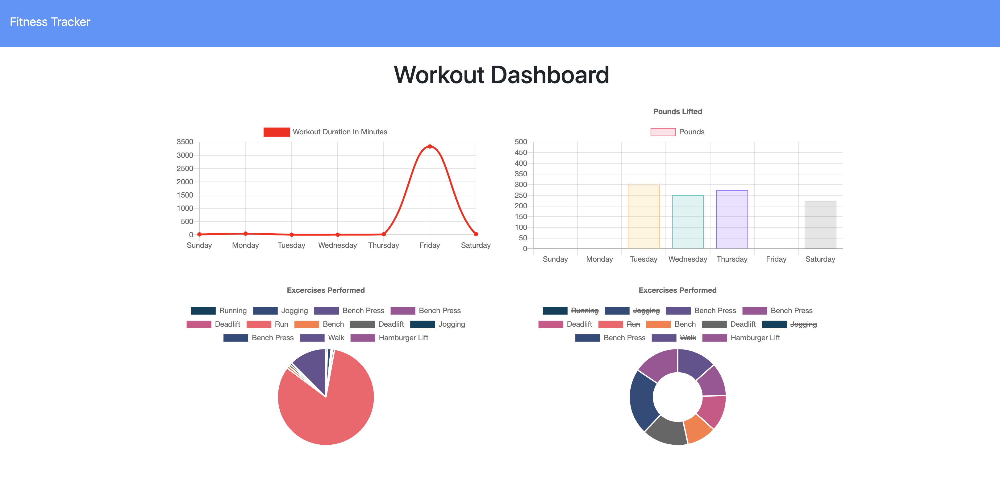

# Fitness Tracker
An application that allows the user to add, view, and track their daily workouts according to type of exercise. They can select either resistance or cardio, as well as specify distance, reps, sets, duration, weight, etc. 

<kbd>

</kbd>

## Functionality 
```
As a user, I want to be able to view create and track daily workouts. I want to be able to log multiple exercises in a workout on a given day. I should also be able to track the name, type, weight, sets, reps, and duration of exercise. If the exercise is a cardio exercise, I should be able to track my distance traveled.
```

## View App
You can preview this app at https://kcredit-fitness-tracker.herokuapp.com/?id=5f7cf43c8ba53500178c3570

## Credits
Starter-Code for this application was provided by Trilogy Education Services for the JHU Web Development Bootcamp. 
It uses [Express](https://www.npmjs.com/package/express), [Node](https://nodejs.org/en/), [MongoDB](https://www.mongodb.com/), [Mongoose](https://www.npmjs.com/package/mongoose/), and [Morgan](https://www.npmjs.com/package/morgan).

Some styling relies on the power of [Bootstrap](https://getbootstrap.com/)

## Other Work
You can see some of my other work at <https://github.com/kimcredit>.    

## License
Copyright (c) 2020 Kim Credit.